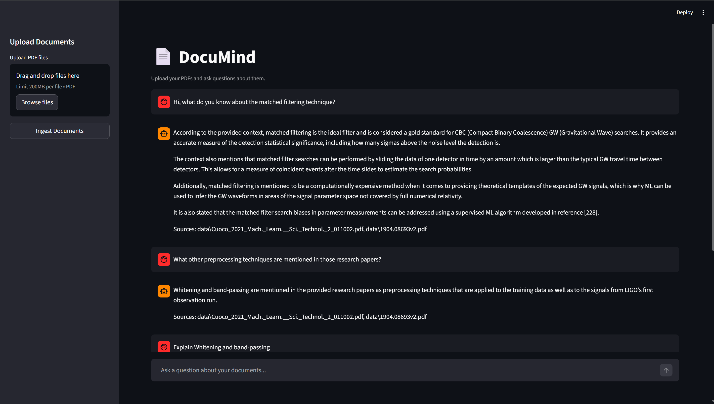
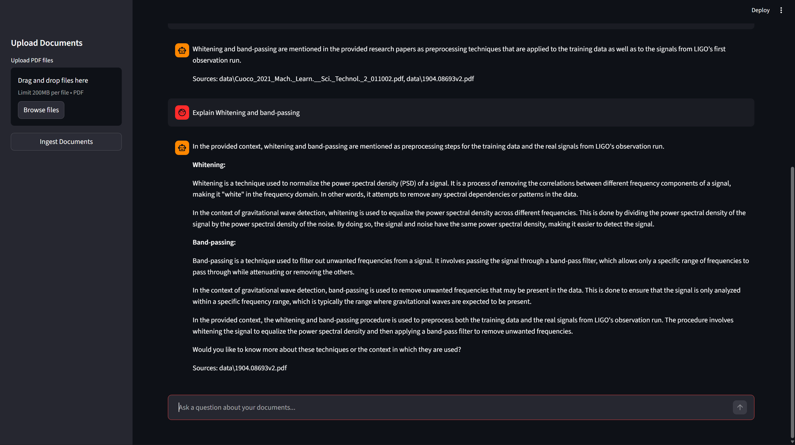

# 📄 DocuMind — AI-Powered Document Research Agent

DocuMind is a RAG-powered research agent built with LangGraph and LangChain that lets you upload PDF documents and ask questions about them — returning answers with cited source filenames, powered by Llama 3.1 and ChromaDB.

---

## 📸 Screenshots

**Chat with cited answers**



## 🚀 Features

- 📁 Upload multiple PDFs directly from the browser
- 🔍 Semantic search over document chunks using ChromaDB
- 🤖 LangGraph-powered stateful agent with retriever and responder nodes
- 💬 Multi-turn conversation memory using LangGraph's `MemorySaver`
- 📄 Cited answers with source filenames
- 🖥️ Clean Streamlit UI with chat interface

---

## 🏗️ Architecture

```
User Question
      ↓
 LangGraph Agent
  ├── Retrieve Node  → ChromaDB semantic search (HuggingFace embeddings)
  └── Respond Node   → Llama 3.1 via Groq API (cited answer)
      ↓
Answer + Sources
```

---

## 🛠️ Tech Stack

| Component | Technology |
|-----------|------------|
| Agent Orchestration | LangGraph + LangChain |
| LLM | Llama 3.1 8B via Groq API |
| Vector Database | ChromaDB |
| Embeddings | HuggingFace `all-MiniLM-L6-v2` |
| PDF Parsing | LangChain PyPDFDirectoryLoader |
| UI | Streamlit |
| Language | Python 3.11 |

---

## 📦 Installation

**1. Clone the repository**

```bash
git clone https://github.com/yourusername/DocuMind.git
cd DocuMind
```

**2. Create a virtual environment**

```bash
python -m venv .venv
.venv\Scripts\activate      # Windows
source .venv/bin/activate   # Mac/Linux
```

**3. Install dependencies**

```bash
pip install -r requirements.txt
```

**4. Set up environment variables**

Create a `.env` file in the root directory:

```
GROQ_API_KEY=your_groq_api_key_here
```

Get your free Groq API key at [console.groq.com](https://console.groq.com)

---

## 📁 Project Structure

```
DocuMind/
├── data/              ← Place your PDF files here
├── chroma_db/         ← Auto-generated vector store
├── ingest.py          ← PDF loading, chunking, embedding pipeline
├── agent.py           ← LangGraph agent graph
├── app.py             ← Streamlit UI
├── requirements.txt
└── .env
```

---

## ▶️ Usage

**Step 1 — Ingest your documents**

Place PDF files in the `data/` folder, then run:

```bash
python ingest.py
```

Or use the **Ingest Documents** button directly in the UI.

**Step 2 — Run the app**

```bash
streamlit run app.py
```

**Step 3 — Ask questions**

Open `http://localhost:8501` in your browser, upload PDFs, and start chatting!

---

## 📋 Requirements

```
langchain
langchain-community
langchain-google-genai
langchain-huggingface
langchain-chroma
langchain-groq
langchain-text-splitters
langgraph
chromadb
streamlit
pypdf
sentence-transformers
google-generativeai
python-dotenv
```

---

## 💡 How It Works

**Ingestion Pipeline (`ingest.py`)**
PDFs are loaded page by page using `PyPDFDirectoryLoader`, split into 1000-character chunks with 200-character overlap using `RecursiveCharacterTextSplitter`, embedded using HuggingFace's `all-MiniLM-L6-v2` model, and persisted locally in ChromaDB.

**Agent Graph (`agent.py`)**
A LangGraph `StateGraph` with two nodes — `retrieve_documents` performs semantic similarity search against ChromaDB returning the top 4 relevant chunks, and `respond` builds a prompt with the retrieved context and invokes Llama 3.1 via Groq to generate a cited answer. Conversation memory is maintained across turns using `MemorySaver`.

---

## 🤝 Contributing

Pull requests are welcome. For major changes, please open an issue first.

---